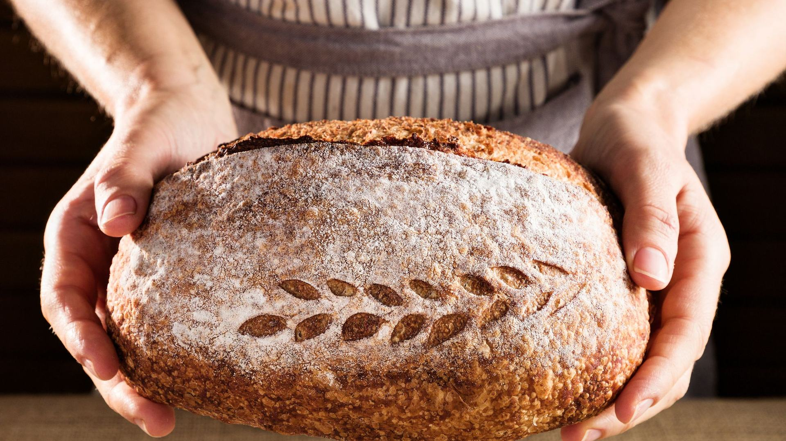
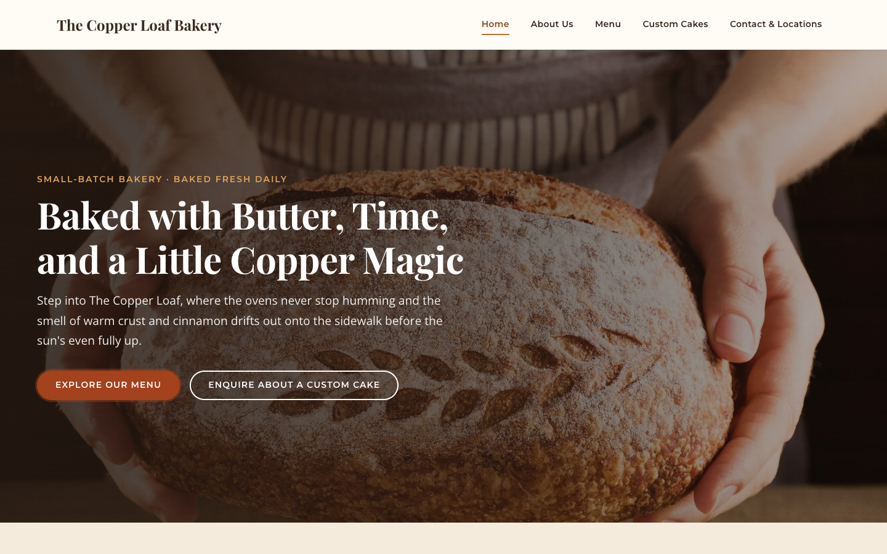
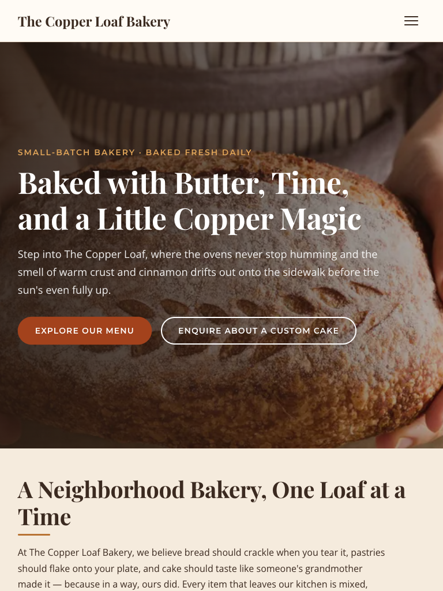
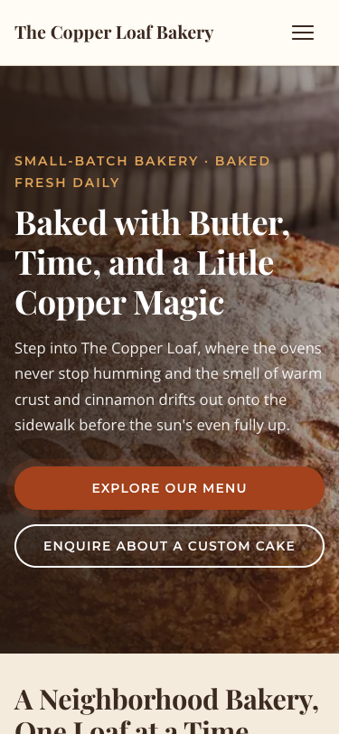

# The Copper Loaf Bakery Website
### A Web Development Project

## Student Information

- **Student Name:** Moarabi Tong
- **Student Number:** ST10541202
- **Module Name:** WEDE5020 Part 1
- **Date of Submission:** 21 August 2026
- **Institution:** The Independent Institute of Education Rosebank College


---

## 1. Project Overview

The Copper Loaf Bakery is a South African artisan bakery based in a suburban neighbourhood, specialising in handmade sourdough bread, organic pastries, custom celebration cakes, and corporate catering. The bakery has built a loyal local following through the quality of its baking and the warmth of its in-store experience, but it has never had a dedicated website. All communication with customers, including product enquiries, custom cake orders, and general questions, currently happens through a combination of a Facebook page and direct WhatsApp messages to bakery staff.

This informal approach has created a number of practical problems. Orders are frequently missed, delayed, or misunderstood because they arrive as unstructured text messages sent at all hours, with no standard format for capturing essential details such as cake size, flavour, dietary requirements, or delivery date. Potential customers browsing Facebook have no easy way to view a full menu with prices, learn about the bakery's story, or find accurate opening hours and locations without messaging someone directly and waiting for a reply. This limits the bakery's ability to project a professional brand image and makes it difficult to convert casual interest into confirmed orders, particularly for higher-value custom cakes and corporate catering enquiries.

This project addresses that gap by designing and building a dedicated, five-page website for The Copper Loaf Bakery. The website centralises the bakery's story, full product menu with descriptions and pricing, a structured custom cake enquiry form, and contact details for both of its locations, all in one professional, easily navigable place. The intention is to reduce reliance on informal WhatsApp ordering, cut down on miscommunication, and give the bakery a consistent, always-available storefront that reflects the quality of its baking.

The primary target audience includes local residents and existing customers looking for daily bread and pastries, individuals and families planning celebrations who need a custom cake, and small businesses or corporate offices seeking catering for meetings and events. A secondary audience includes new residents to the area discovering the bakery for the first time through search engines or social media.

The website has been developed using HTML5 for semantic page structure and content, with CSS3 planned for styling and responsive layout, and JavaScript planned for interactive functionality such as form validation, the WhatsApp floating button behaviour, and future dynamic features. At this stage of the project, the focus has been on building complete, well-structured HTML content and page architecture, with styling and scripting to follow in subsequent development phases.

---

## 2. Website Goals and Objectives

### Goal 1: Establish a professional, mobile-friendly online storefront and brand presence

**Description:** Give The Copper Loaf Bakery a dedicated, branded website that reflects the quality and warmth of its products, independent of third-party social platforms. The site should present the bakery's story, products, and locations clearly and consistently, and be fully usable on mobile devices, since most local customers are expected to browse from their phones.

**Key Performance Indicators (KPIs):**
- Website successfully displays and functions correctly across mobile, tablet, and desktop screen sizes
- Increase in direct website visits over time, measured through analytics once deployed
- Reduction in the proportion of customers who report finding the bakery only through Facebook
- Positive informal feedback from customers and bakery staff on the site's appearance and ease of use

### Goal 2: Reduce missed or incorrect orders by replacing ad-hoc WhatsApp ordering with a structured system

**Description:** Introduce structured, field-based forms, particularly the Custom Cake Enquiry form, so that customers provide all necessary order details (occasion, date, size, flavour, dietary requirements, budget) in a consistent format from the outset. This reduces back-and-forth clarification messages and lowers the risk of orders being misread or forgotten in a crowded WhatsApp inbox.

**Key Performance Indicators (KPIs):**
- Decrease in the number of follow-up messages required per order to clarify missing details
- Decrease in reported order errors (wrong flavour, wrong date, wrong size) after launch
- Percentage of custom cake orders received via the website form rather than WhatsApp
- Staff-reported time saved per order when using the structured form versus manual chat threads

### Goal 3: Generate qualified leads for custom cakes and corporate catering

**Description:** Use dedicated content and calls-to-action, including the Custom Cake Enquiry page and clear contact options, to capture enquiries from customers who are further along in their decision-making process, such as those planning a wedding, birthday, or corporate event. This should help the bakery prioritise higher-value orders and respond to serious enquiries more efficiently.

**Key Performance Indicators (KPIs):**
- Number of custom cake enquiry form submissions per month
- Number of corporate catering enquiries received through the contact form
- Conversion rate of enquiries submitted through the website into confirmed bookings
- Average order value of leads generated via the website compared to walk-in or WhatsApp orders

---

## 3. Key Features and Functionality

- **Navigation Menu:** A consistent header navigation bar present on all five pages, linking to Home, About Us, Menu, Custom Cakes, and Contact & Locations, allowing visitors to move easily between sections of the site.

- **Homepage:** Includes a welcoming hero section with a headline and call-to-action buttons, an introductory section describing the bakery's approach, and a featured products section highlighting a rotating selection of bestsellers with descriptions and prices.

- **About Us Page:** Tells the story of how the bakery began, outlines its mission and values, and introduces the head baker through a personal profile, helping build trust and an emotional connection with visitors.

- **Products / Menu Page:** A fully categorised menu (Breads, Pastries, Cakes & Sweets, Coffee & Drinks) with individual product descriptions written in warm, sensory language, alongside clearly listed prices for each item.

- **Custom Cake Enquiry Form:** A detailed, multi-field form capturing contact details, event date, occasion, guest count, cake size, flavour and filling preferences, design inspiration, dietary requirements, and budget, supported by a Frequently Asked Questions section addressing common customer concerns.

- **Contact Page:** Displays full details for both bakery locations, including addresses, phone numbers, email addresses, and opening hours, alongside a general enquiry contact form for questions that fall outside the custom cake process.

- **WhatsApp Floating Button (Planned):** A persistent, floating WhatsApp icon to be implemented site-wide, giving customers a quick, familiar way to reach the bakery directly for urgent or simple queries without leaving the current page.

- **SEO Meta Tags:** Each page includes a unique meta title and meta description, written to improve visibility in search engine results and accurately describe the content and purpose of that page.

- **Responsive Design (Planned):** Future CSS development will ensure the layout adapts smoothly across mobile, tablet, and desktop devices, prioritising a mobile-first experience given the bakery's local, phone-browsing customer base.

- **Pre-Order System (Planned for Future Phase):** A longer-term enhancement to allow customers to reserve or pre-order daily bread and pastry items online ahead of collection, reducing in-store queues and missed stock.

---

## 4. Timeline and Milestones

| Week | Phase | Milestones |
|------|-------|------------|
| Weeks 1–2 | Research, Content Audit & Wireframing | Conduct research into the bakery's existing informal channels (Facebook, WhatsApp); audit existing content, product lists, and pricing; interview bakery owner and staff on requirements; produce low-fidelity wireframes for all five pages; finalise sitemap and navigation structure. |
| Weeks 3–5 | Visual Design & Owner Sign-Off | Develop the visual design direction (colour palette, typography, imagery style) reflecting the bakery's artisan brand; produce high-fidelity mockups of key pages; present designs to the bakery owner for feedback; revise designs based on owner input; obtain formal sign-off on final visual design before development begins. |
| Weeks 6–8 | Development, E-Commerce & Booking-Form Build | Build out semantic HTML structure for all five pages; implement CSS styling and responsive layout based on approved designs; develop the Custom Cake Enquiry form and Contact form functionality; integrate the WhatsApp floating button; begin implementation of e-commerce/pre-order components where applicable; conduct internal developer testing throughout. |
| Week 9 | Content Population & Testing | Populate all final approved copy, product descriptions, prices, and images across the site; conduct full testing of the ordering and payment process, including form validation and submission handling; perform cross-browser and cross-device testing; carry out user acceptance testing with bakery staff and a small group of customers; log and resolve identified issues. |
| Week 10 | Launch & Handover Training | Deploy the finalised website to its live hosting environment; perform final pre-launch checks (links, forms, SEO tags, responsiveness); conduct handover training sessions with bakery staff on managing enquiries received through the site; provide basic documentation for ongoing content updates; officially launch the website. |

---

## 5. Styling with CSS (style.css)

All five pages share one external stylesheet, `style.css`, and one small script, `script.js`, which powers the mobile hamburger menu.

### 5.1 Linking the stylesheet

The following lines are placed inside the `<head>` of **every** page (`index.html`, `about.html`, `products.html`, `custom-cakes.html`, `contact.html`):

```html
<!-- Google Fonts: Playfair Display (headings), Montserrat (subheadings), Open Sans (body) -->
<link rel="preconnect" href="https://fonts.googleapis.com">
<link rel="preconnect" href="https://fonts.gstatic.com" crossorigin>
<link href="https://fonts.googleapis.com/css2?family=Montserrat:wght@500;600;700&family=Open+Sans:wght@400;600&family=Playfair+Display:ital,wght@0,600;0,700;1,600&display=swap" rel="stylesheet">

<!-- External stylesheet -->
<link rel="stylesheet" href="style.css">
```

### 5.2 File structure

```
copper-loaf/
├── index.html
├── about.html
├── products.html
├── custom-cakes.html
├── contact.html
├── style.css          ← all styling, organised into 24 commented sections
├── script.js          ← hamburger menu toggle (progressive enhancement)
├── images/            ← 26 photos, each in 2–3 widths, as WebP + JPEG
├── screenshots/       ← desktop, tablet and mobile screenshots
└── README.md
```

### 5.3 Stylesheet organisation

`style.css` opens with a table of contents and is split into clearly commented sections:

1. CSS custom properties (design tokens)
2. Modern CSS reset (`box-sizing: border-box` globally)
3. Base typography
4. Links
5. Buttons and calls to action
6. Layout utilities (`.container`, section spacing)
7. Accessibility utilities (`.sr-only`, `.skip-link`, focus styles)
8. Site header and navigation (including the hamburger menu)
9. Hero section
10. Page header (inner pages)
11. Introduction and split (image + text) sections
12. Product cards
13. Menu categories
14. Testimonials
15. Homepage callout
16. Gallery grid
17. Locations / contact wrapper
18. Forms
19. FAQ cards
20. Site footer
21. Animations (`fadeInUp`, `fadeInDown`, `pulse`)
22. Responsive breakpoints
23. Reduced motion
24. Print styles

All class names and IDs use consistent **kebab-case** (e.g. `.site-header`, `.nav-link`, `.featured-item`, `.gallery-grid`, `#main-content`).

### 5.4 Design tokens

| Token | Value | Use |
|-------|-------|-----|
| `--color-primary` | `#8C4A1C` Copper | Links, prices, accents (6.6:1 on cream) |
| `--color-primary-light` | `#B87333` Bright copper | Decorative rules and borders only |
| `--color-secondary` | `#4A6347` Sage | Secondary (outlined) buttons |
| `--color-accent` | `#A3421C` Rust | Primary CTAs (6.3:1 with white text) |
| `--color-highlight` | `#E0A458` Honey gold | Text on dark backgrounds only |
| `--color-text` | `#3B2A20` Espresso | Body text (13.2:1 on cream) |
| `--color-bg` / `--color-bg-alt` | `#FFFBF5` Cream / `#F5EBDD` Oat | Page and alternating section backgrounds |
| `--font-heading` | Playfair Display | h1–h4 |
| `--font-subheading` | Montserrat | h5, h6, nav, buttons, labels |
| `--font-body` | Open Sans | Paragraphs |
| `--space-xs` … `--space-xl` | 0.5 / 1 / 2 / 4 / 6 rem | All margins, padding and gaps |
| `--radius-sm/md/lg/pill` | 4px / 8px / 16px / 999px | Corners |
| `--shadow-sm/md/lg` | Warm-brown tinted | Card elevation |

**Type scale:** h1 3rem, h2 2.5rem, h3 1.75rem, h4 1.25rem. h1–h3 scale down smoothly on small screens with `clamp()`. h5 and h6 are small uppercase Montserrat subheadings. Paragraphs are 1rem with a 1.7 line-height.

### 5.5 Example HTML: how the classes are applied (homepage)

```html
<a class="skip-link" href="#main-content">Skip to main content</a>

<header class="site-header">
  <div class="container header-inner">
    <div class="logo"><a href="index.html">The Copper Loaf Bakery</a></div>
    <button class="nav-toggle" type="button" aria-expanded="false" aria-controls="primary-nav">
      <span class="nav-toggle-bar" aria-hidden="true"></span>
      <span class="nav-toggle-bar" aria-hidden="true"></span>
      <span class="nav-toggle-bar" aria-hidden="true"></span>
      <span class="sr-only">Open menu</span>
    </button>
    <nav id="primary-nav" class="primary-nav" aria-label="Main">
      <ul class="nav-list">
        <li><a class="nav-link" href="index.html" aria-current="page">Home</a></li>
        <!-- …other links… -->
      </ul>
    </nav>
  </div>
</header>

<main id="main-content">
  <section class="hero">
    <picture class="hero-media">
      <source type="image/webp"
              srcset="images/hero-bread-in-hands-800.webp 800w,
                      images/hero-bread-in-hands-1280.webp 1280w,
                      images/hero-bread-in-hands-1920.webp 1920w"
              sizes="100vw">
      
    </picture>
    <div class="hero-content">
      <p class="hero-eyebrow">Small-batch bakery · Baked fresh daily</p>
      <h1>Baked with Butter, Time, and a Little Copper Magic</h1>
      <p class="hero-subtitle">…</p>
      <div class="button-group">
        <a href="products.html" class="cta-button">Explore Our Menu</a>
        <a href="custom-cakes.html" class="cta-button-secondary">Enquire About a Custom Cake</a>
      </div>
    </div>
  </section>

  <section class="featured-products">
    <h2>Fresh From the Oven This Week</h2>
    <article class="featured-item">
      <div class="card-media"><picture>…</picture></div>
      <h3>Rosemary Sea Salt Sourdough</h3>
      <p>…</p>
      <p class="price">R65</p>
    </article>
    <!-- …three more cards… -->
    <a href="products.html" class="cta-button">See the Full Menu</a>
  </section>

  <section class="testimonials">
    <h2>What Our Regulars Say</h2>
    <div class="testimonial-grid">
      <figure class="testimonial-card">
        <blockquote><p>…</p></blockquote>
        <figcaption class="testimonial-author">Thandi M. · Downtown regular</figcaption>
      </figure>
    </div>
  </section>
</main>

<footer class="site-footer">
  <div class="container footer-grid">
    <div class="footer-about">…</div>
    <div class="footer-links">…</div>
    <div class="footer-locations">…</div>
    <div class="footer-social">…</div>
    <div class="footer-bottom">…</div>
  </div>
</footer>
```

`.btn-primary` and `.btn-secondary` share their styles with the existing `.cta-button` and `.cta-button-secondary` classes, so either name works.

### 5.6 Key CSS decisions

- **Mobile-first.** The base styles are written for phones. `min-width` media queries then add columns and larger spacing as space allows, so small, low-powered devices download and apply the least CSS.
- **Design tokens in `:root`.** Every colour, font, space, radius and shadow is a custom property. Changing the brand palette means editing one place, not hunting through 1,000 lines.
- **Accessible palette.** The bright copper `#B87333` only reaches 3.7:1 against cream, which fails WCAG AA for text. It is therefore used only for decorative lines, and a deeper copper (`#8C4A1C`, 6.6:1) is used for text. Every text/background pair used was contrast-checked.
- **Grid for two-dimensional layouts, Flexbox for one-dimensional ones.** Card grids use `repeat(auto-fit, minmax(min(100%, 260px), 1fr))`, so they reflow from 4 → 3 → 2 → 1 columns without any media query. The `min(100%, …)` stops the grid overflowing on 320px screens. The header, button groups and card internals use Flexbox.
- **Full-bleed sections without extra wrapper divs.** Each `main > section` uses `padding-inline: max(var(--gutter), (100% - var(--container-max)) / 2)`. Section backgrounds stretch edge to edge, while the content stays within 1200px (1320px on large screens). The header and footer use the `.container` class.
- **Fluid typography and spacing.** `clamp()` scales headings and section padding smoothly between breakpoints instead of jumping.
- **Responsive images.** Every photo is a `<picture>` element that offers WebP (smaller) with a JPEG fallback. `srcset` and `sizes` let the browser download only the width it needs, which is about 400px wide on a phone instead of 1,200px. `width`/`height` attributes prevent layout shift while images load. Images below the fold use `loading="lazy"`; the hero uses `fetchpriority="high"`.
- **Hero overlay.** A dark gradient `::before` layer sits between the photo and the text, so white text passes contrast no matter which part of the photo it covers.
- **Progressive-enhancement hamburger.** The menu only collapses when JavaScript has added a `js` class to `<html>`. If the script fails, the links stay visible. The button uses `aria-expanded` and `aria-controls`, and Escape closes the menu.
- **Card consistency.** Cards are flex columns with `margin-top: auto` on the price, so prices line up along the bottom even when descriptions differ in length.

### 5.7 Accessibility features

- Skip link ("Skip to main content") that appears on keyboard focus.
- High-contrast `:focus-visible` outlines (3px rust ring) for keyboard users, hidden for mouse clicks.
- `aria-current="page"` highlights the current page in the navigation.
- `.sr-only` utility for screen-reader-only text (e.g. the hamburger's "Open menu" label).
- Descriptive `alt` text on every image.
- Form fields are at least 48px tall with 16px text (prevents iOS zoom). Borders meet the 3:1 non-text contrast rule. Invalid fields are only flagged after user interaction (`:user-invalid`).
- `prefers-reduced-motion` turns off animations, hover lifts and smooth scrolling.
- Print styles hide navigation, images and buttons, force black text on white, and print link URLs.

### 5.8 Breakpoints

| Breakpoint | Media query | What changes |
|-----------|-------------|--------------|
| Mobile | `max-width: 480px` | Full-width buttons; tighter padding on forms and cards |
| Tablet | `min-width: 481px` / `min-width: 769px` | Footer 2 columns → split sections side by side, locations 2 columns, gallery 3 columns |
| Desktop | `min-width: 1024px` | Hamburger replaced by a horizontal nav with animated underline; footer 4 columns; feature tile in gallery |
| Large desktop | `min-width: 1440px` | Container widens to 1320px; body text 17px; taller hero |

---

## 6. Responsive Testing Checklist

Test every page at each width below and tick off each item:

- [ ] No horizontal scrollbar at 320px, 375px, 768px, 1024px or 1440px
- [ ] Hamburger button is visible below 1024px; it opens and closes the menu and the icon changes to an "X"
- [ ] Pressing Escape closes the mobile menu
- [ ] Horizontal navigation is visible at 1024px and above; the current page is underlined
- [ ] Hero text is readable over the photo at every width
- [ ] Product and menu cards reflow 4 → 3 → 2 → 1 columns; prices line up at the bottom of each row
- [ ] About-page image/text sections sit side by side on tablet and desktop and stack on mobile
- [ ] Gallery shows 2 columns on mobile and 3 on desktop (cake gallery: 4)
- [ ] Location cards sit side by side from 769px
- [ ] Form fields are full width, easy to tap, and show a copper glow on focus
- [ ] Footer shows 1 → 2 → 4 columns
- [ ] Tab through each page: skip link appears first, and every link, button and field shows a visible focus ring
- [ ] Images look sharp on retina screens and are not stretched or squashed
- [ ] With "reduce motion" switched on in the OS, nothing animates
- [ ] Print preview (Ctrl/Cmd + P) shows clean black-on-white text with no navigation

---

## 7. Browser Developer Tools Testing Guide

These steps use Google Chrome; Edge and Firefox work almost identically.

1. Open `index.html` in Chrome.
2. Open DevTools: **F12**, or **Ctrl + Shift + I** (Windows) / **Cmd + Option + I** (Mac).
3. Turn on the Device Toolbar: **Ctrl + Shift + M** (Windows) / **Cmd + Shift + M** (Mac), or click the phone/tablet icon.
4. In the "Dimensions" dropdown choose **Responsive**, then type each width into the width box:

| Width | Represents | What to check |
|-------|-----------|---------------|
| **320px** | Small / older phones (iPhone SE 1st gen) | Worst case for overflow: headings wrap, buttons are full width, nothing is cut off |
| **375px** | Standard phones (iPhone 12/13 mini, many Androids) | Hamburger works, cards are single-column, form is comfortable to fill in |
| **768px** | Tablet portrait (iPad) | Cards in 2 columns, footer in 2 columns, hamburger still shown |
| **1024px** | Tablet landscape / small laptop | Horizontal nav appears, split sections side by side, footer 4 columns |
| **1440px** | Large desktop monitor | Content centred and capped at 1320px, no over-stretched lines of text |

5. **Check for horizontal scrolling:** at each width, open the Console tab and run:
   ```js
   document.documentElement.scrollWidth > document.documentElement.clientWidth
   ```
   `false` means there is no horizontal overflow.
6. **Check which image was downloaded:** open the **Network** tab, filter by **Img**, and reload. At 375px you should see the `-400.webp` or `-600.webp` files. At 1440px you should see the larger files.
7. **Check contrast:** in the **Elements** tab, click any text element. The **Styles** pane shows a contrast ratio next to the colour swatch; AA requires 4.5 or higher.
8. **Emulate reduced motion and print:** open the Command Menu (**Ctrl/Cmd + Shift + P**), type **"Rendering"**, and set *Emulate CSS media feature prefers-reduced-motion* to `reduce`, or *Emulate CSS media type* to `print`.
9. **Run Lighthouse:** open the **Lighthouse** tab, tick *Accessibility*, *Best Practices* and *Performance*, choose Mobile, and click *Analyze page load*.

---

## 8. Screenshots

The screenshots below are saved in the `screenshots/` folder.

| Desktop (1440px) | Tablet (768px) | Mobile (375px) |
|---|---|---|
|  |  |  |

### How to capture your own screenshots

1. Open the page in Chrome and turn on the Device Toolbar (see Section 7).
2. Set the width to **1440 × 900** (desktop), **768 × 1024** (tablet) or **375 × 812** (mobile).
3. Click the **⋮** menu in the Device Toolbar and choose **Capture screenshot** for the visible area, or **Capture full size screenshot** for the whole page.
4. Save the file into `screenshots/` using the pattern `page-device-width.png`, e.g. `menu-mobile-375.png`.
5. For mobile, also capture one screenshot with the hamburger menu **open**, to show the mobile navigation working.
6. Take each screenshot at the top of the page with the hero visible, and add full-page captures for the Menu and Custom Cakes pages to show the grids and form.

---

## 9. Image Credits

All photographs are free-to-use stock images from [Pexels](https://www.pexels.com/license/). The Pexels licence allows free commercial and non-commercial use without attribution; they are credited here as good practice. Each image was cropped and exported by the developer in several widths, in WebP and JPEG formats.

| File name (in `images/`) | Used on | Source |
|---|---|---|
| `hero-bread-in-hands` | Home hero | [Pexels #13247705](https://www.pexels.com/photo/person-holding-loaf-of-bread-13247705/) |
| `featured-rosemary-sourdough` | Home | [Pexels #6605201](https://www.pexels.com/photo/sourdough-bread-with-burnt-crust-on-table-6605201/) |
| `featured-almond-croissant` | Home | [Pexels #19296861](https://www.pexels.com/photo/delicious-croissant-in-close-up-view-19296861/) |
| `featured-caramel-brownie` | Home | [Pexels #25595974](https://www.pexels.com/photo/a-slice-of-a-chocolate-brownie-on-a-plate-25595974/) |
| `featured-vanilla-cake` | Home | [Pexels #31243101](https://www.pexels.com/photo/elegant-white-wedding-cake-with-floral-decor-31243101/) |
| `callout-birthday-cake` | Home callout | [Pexels #19310813](https://www.pexels.com/photo/birthday-cake-with-candles-and-flowers-19310813/) |
| `about-bakery-window` | About | [Pexels #20140442](https://www.pexels.com/photo/view-of-bread-in-a-window-display-of-a-bakery-20140442/) |
| `about-sliced-bread` | About | [Pexels #7693958](https://www.pexels.com/photo/slices-of-delicious-homemade-bread-7693958/) |
| `about-shaping-dough` | About | [Pexels #5903446](https://www.pexels.com/photo/hands-kneading-a-dough-5903446/) |
| `gallery-fresh-loaf` | About gallery | [Pexels #13247700](https://www.pexels.com/photo/a-person-s-hands-holding-a-loaf-of-bread-13247700/) |
| `gallery-shaping-croissants` | About gallery | [Pexels #7966375](https://www.pexels.com/photo/a-pastry-chef-making-croissants-7966375/) |
| `gallery-egg-wash` | About gallery | [Pexels #7965949](https://www.pexels.com/photo/man-basting-croissants-before-baking-7965949/) |
| `gallery-cinnamon-buns` | About gallery | [Pexels #17430536](https://www.pexels.com/photo/cinnamon-rolls-17430536/) |
| `gallery-baker-at-work` | About gallery | [Pexels #7447297](https://www.pexels.com/photo/a-baker-kneading-a-dough-7447297/) |
| `gallery-latte` | About gallery | [Pexels #9249368](https://www.pexels.com/photo/overhead-shot-of-a-cup-of-cappuccino-drink-with-latte-art-9249368/) |
| `menu-breads` | Menu | [Pexels #105861](https://www.pexels.com/photo/bread-food-baked-goods-loaves-105861/) |
| `menu-pastries` | Menu | [Pexels #3341067](https://www.pexels.com/photo/breads-in-a-bakery-3341067/) |
| `menu-cakes` | Menu | [Pexels #2373520](https://www.pexels.com/photo/close-up-photo-of-stacked-chocolate-brownies-2373520/) |
| `menu-coffee` | Menu | [Pexels #186857](https://www.pexels.com/photo/cappuccino-on-table-186857/) |
| `cakes-floral-display` | Custom Cakes | [Pexels #3014858](https://www.pexels.com/photo/white-4-tier-cake-3014858/) |
| `cakes-four-tier` | Custom Cakes gallery | [Pexels #1038711](https://www.pexels.com/photo/4-tier-cake-on-cake-stand-1038711/) |
| `cakes-gold-stand` | Custom Cakes gallery | [Pexels #34596959](https://www.pexels.com/photo/elegant-three-tier-white-wedding-cake-on-gold-stand-34596959/) |
| `cakes-naked-floral` | Custom Cakes gallery | [Pexels #4693617](https://www.pexels.com/photo/white-and-brown-3-tier-cake-4693617/) |
| `cakes-birthday-sprinkle` | Custom Cakes gallery | [Pexels #7337072](https://www.pexels.com/photo/birthday-cake-with-candles-on-table-7337072/) |
| `location-downtown` | Contact | [Pexels #10438814](https://www.pexels.com/photo/interior-design-of-a-bakery-shop-10438814/) |
| `location-northside` | Contact | [Pexels #3639538](https://www.pexels.com/photo/pastries-on-clear-glass-display-counter-3639538/) |

Fonts: [Playfair Display, Montserrat and Open Sans](https://fonts.google.com/) via Google Fonts (SIL Open Font License).
